# Introduction to Joining Data Tables with R

*Disclaimer: This is the iterated version of my old LinkedIn [post](https://www.linkedin.com/pulse/joining-data-dplyr-package-r-arif-setyawan/). There are some changes in the writing and use cases in comparison to the old version.*

 on [Unsplash](https://unsplash.com/photos/Zyx1bK9mqmA?utm_source=unsplash&utm_medium=referral&utm_content=creditCopyText)*](asset/cover.jpg)

*Illustration asset by [Hannah Busing](https://unsplash.com/de/@hannahbusing?utm_source=unsplash&utm_medium=referral&utm_content=creditCopyText) on [Unsplash](https://unsplash.com/photos/Zyx1bK9mqmA?utm_source=unsplash&utm_medium=referral&utm_content=creditCopyText)*

---

## Table of Content

  * [Joining Table](#joining-table)
  * [Types of Join](#types-of-join)
    + [For illustration purpose](#for-illustration-purpose)
    + [INNER join](#inner-join)
    + [LEFT, RIGHT, and FULL join](#left-right-and-full-join)
    + [SEMI and ANTI join](#semi-and-anti-join)
  * [Practical Examples](#practical-examples)
  * [Excel and Google Sheets special pick](#excel-and-google-sheets-special-pick)
  * [Closing Thoughts](#closing-thoughts)
  * [References](#references)

---

In my previous [post](https://github.com/rifset/data-manipulation-in-sql-and-r), I wrote about data manipulation both in R with the `dplyr` package and SQL with Google Big Query. This time, I will write about joining data table in R with the same package. I write this based on my experiences, so please let me know if there is any mistake.

## Joining Table

Join is needed when we want to combine two or more tables with shared columns. These shared columns are called keys (called primary and foreign keys in database management). Suppose we have a table consisting of customers’ membership IDs, their full names, and genders. We also have another table consisting of the same customers’ membership IDs and their respective home addresses. We wanted to know the address of a specific customer. Unfortunately, those tables do not have the same dimension, and the entries are not in sequence. Thus, we need to JOIN them to achieve what we wanted to.

## Types of Join

There are six types of JOIN in the `dplyr` package: inner, right, left, full, semi, and anti-join.

<p align = "center">
  
</p>

The illustration above is from [Rpubs](https://rpubs.com/jcross/joins).

### For illustration purpose

To demonstrate, I created some artificial data into three different tables. Each contains specific information. Copy the practice data [here](https://docs.google.com/spreadsheets/d/10xOrTcB4eOWK-OQAzE-yQ35tbVrwThZEYDfGU1dO8IA/edit?usp=sharing) or see `/asset`.

```r
library(tidyverse)

characters <- read_csv("characters.csv")
series <- read_csv("series.csv")
releasedate <- read_csv("releasedate.csv")
```

### INNER join

The first is an INNER join. It returns data entries that belong to both tables. If the second table has multiple entries for the same key, all entries will return. This type of join is handy if we are sure that all our entries in the first table are in the second table.

```r
# INNER join
characters %>% 
  inner_join(series, by = c("id" = "characters_id"))
```

<p align = "center">
  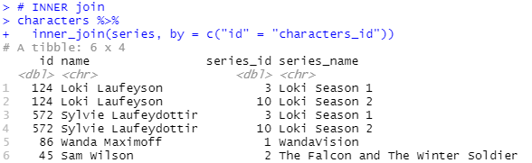
</p>

### LEFT, RIGHT, and FULL join

In the other case, when we are not sure about our tables, we can use LEFT, RIGHT, or FULL join. A LEFT join returns all entries from the first table and leaves out those entries, which do not have any matches, with NAs (missing value). A LEFT join is like VLOOKUP in Excel and Google Sheets (I will talk about this later). 

```r
# LEFT join
characters %>% 
  left_join(series, by = c("id" = "characters_id"))
```

<p align = "center">
  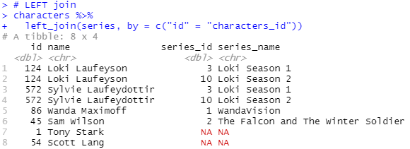
</p>

A RIGHT join does the same thing as a LEFT join, but instead, it returns entries from the second table. 

```r
# RIGHT join
characters %>% 
  right_join(series, by = c("id" = "characters_id"))
```

<p align = "center">
  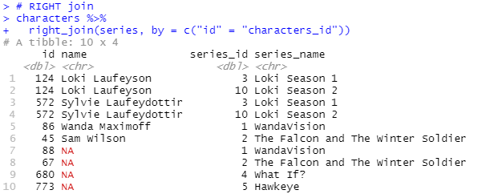
</p>

A FULL join returns all entries from both tables and marks those with no matches entries with NAs.

```r
# FULL join
characters %>% 
  full_join(series, by = c("id" = "characters_id"))
```

<p align = "center">
  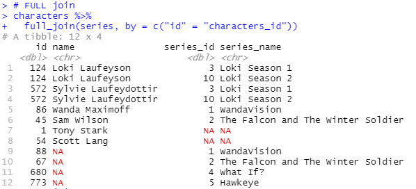
</p>

### SEMI and ANTI join

The last two joins are SEMI and ANTI join. These two joins do a bit differently from the other type of joins. Both SEMI and ANTI joins do not return entries from the second table. These two joins are handy for filtering purposes. A SEMI join returns entries from the first table, which exist on the second table. 

```r
# SEMI join
characters %>% 
  semi_join(series, by = c("id" = "characters_id"))
```

<p align = "center">
  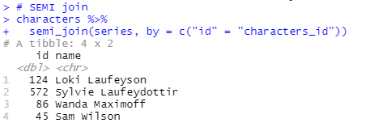
</p>

In contrast, an ANTI join returns entries that don’t exist on the second table. For example, we can use ANTI join to exclude stop words from our text document data.

```r
# ANTI join
characters %>% 
  anti_join(series, by = c("id" = "characters_id"))
```

<p align = "center">
  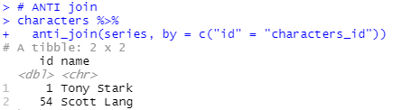
</p>

## Practical Examples

Let’s get a little more serious with study cases.

**Case 1:** Suppose we want to know how many characters are from The Falcon and The Winter Soldier TV series. We use RIGHT join to solve this case. Why? We are not sure how many characters are existed, and we do not want any loss of information. If we use a LEFT join, we will never know if there are two characters from The Falcon and The Winter Soldier TV series.

```r
# Case 1
characters %>% 
  right_join(series, by = c("id" = "characters_id")) %>% 
  filter(series_name == "The Falcon and The Winter Soldier")
```

<p align = "center">
  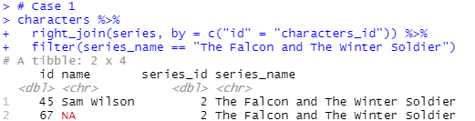
</p>

**Case 2:** Suppose we want to know the name of the characters and their respective TV series that were not released. We may use two approaches. The first can be done using INNER and LEFT join, while the second approach is via LEFT join only. Please note that by default R will return columns with the same name but modified in such have additional characters that distinguish from which table they originally belonged.

```r
# Case 2 (approach 1)
characters %>% 
  inner_join(
    series %>% 
      left_join(releasedate, by = "series_id"),
    by = c("id" = "characters_id")
  ) %>% 
  filter(release_date == "TBA")

# Case 2 (approach 2)
characters %>% 
  left_join(series, by = c("id" = "characters_id")) %>% 
  left_join(releasedate, by = "series_id") %>% 
  filter(release_date == "TBA")
```

<p align = "center">
  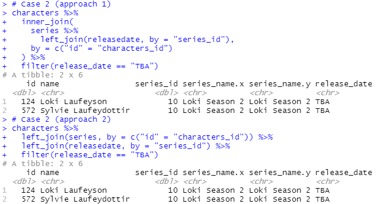
</p>

**Case 3:** Suppose we want to redo study case #2, but the expected return is just the names. A SEMI join will solve the case.

```r
# Case 3
characters %>% 
  semi_join(
    series %>% 
      left_join(releasedate, by = "series_id") %>% 
      filter(release_date == "TBA"),
    by = c("id" = "characters_id")
  )
```

<p align = "center">
  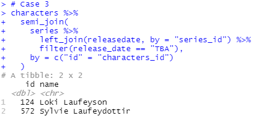
</p>

**Case 4:** Suppose we want to redo study case #3, but instead, for characters who do not have any listed TV series that were released or have not been released yet. An ANTI join will solve the case.

```r
# Case 4
characters %>% 
  anti_join(
    series %>% 
      left_join(releasedate, by = "series_id") %>% 
      filter(!is.na(release_date)),
    by = c("id" = "characters_id")
  )
```

<p align = "center">
  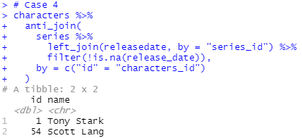
</p>

## Excel and Google Sheets special pick

As mentioned earlier, the formula VLOOKUP in Excel and Google Sheets is basically a LEFT join.

Paste this formula in cell `C2` in the `characters` sheet.

```vba
=ArrayFormula(VLOOKUP($A$2:$A$7;series!$A$1:$C$9;3;FALSE))
```

<p align = "center">
  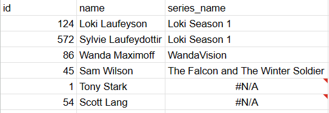
</p>

You can also do an INNER join, but using a two-step formula including previously talked VLOOKUP. After you pasted `C2`'s formula, proceed to go to cell `E1` and pasted the formula below

```vba
=ArrayFormula(FILTER(A1:C;NOT(ISNA(C1:C))))
```

And voila, inner joined!

<p align = "center">
  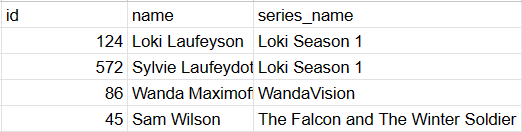
</p>

## Closing Thoughts

For simple tables, matching by hand will also work, but when the tables are larger and more complex, JOINs will be practical. There is an enormous number of joining table uses, you may find it yourself as you more study about it. I hope this article gives you insights. *After all, joining is Flexible, Useful, and Necessary (FUN), right? :) See you in another article and stay hydrated.*

***Joining table can be FUN, eh?***

---

## References

[1] “RPubs - Introduction to Joins,” [rpubs.com](http://rpubs.com/). [https://rpubs.com/jcross/joins](https://rpubs.com/jcross/joins) (accessed Sep. 12, 2021).
‌
